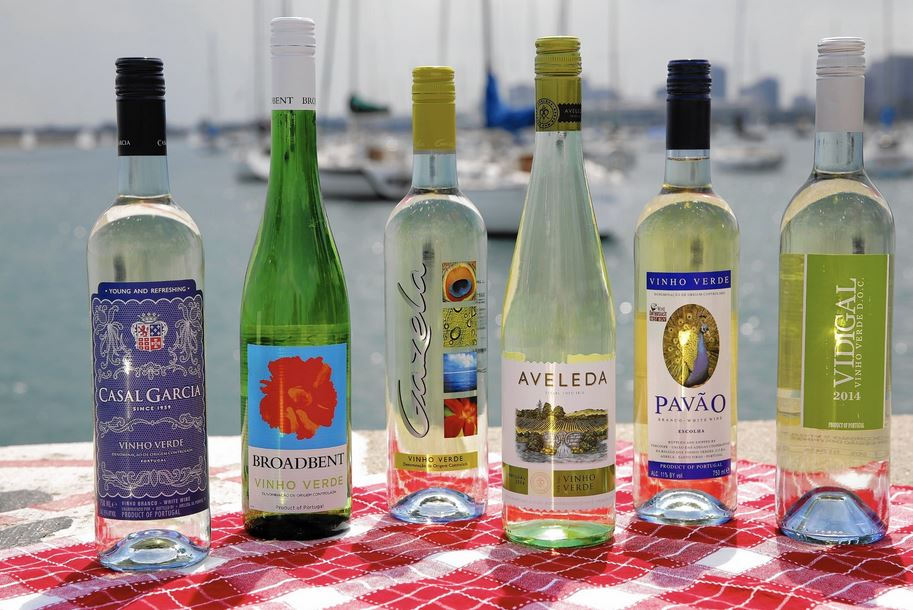

```{r setup, include=FALSE}
knitr::opts_chunk$set(echo = FALSE)
```

## Can Robots Taste Wine?

```{r fig.align = "center", out.width = "1\\textwidth"}

```

## Vihno Verde - 2000 Years of Winemaking

```{r out.width = "1\\textwidth"}

#
```

## Wines Dataset Attributes

```
6497 observations:

Input variables (based on physicochemical tests): 
  1 - fixed acidity        (FA)
  2 - volatile acidity     (VA)
  3 - citric acid          (CA)
  4 - residual sugar       (RS)
  5 - chlorides            (CH)
  6 - free sulfur dioxide  (FSD)
  7 - total sulfur dioxide (TSD)
  8 - density              (DEN)
  9 - pH                   (pH)
  10 - sulphates           (SUL)
  11 - alcohol             (ALC) 

Output variable (based on sensory data): 
  12 - quality (score between 0 and 10) - (QLT)
```

## Wines Quality Dataset - First Rows
```{r message=FALSE, warning=FALSE, include=FALSE}
wines_red_data <- 
  read.csv(
    "http://archive.ics.uci.edu/ml/machine-learning-databases/wine-quality/winequality-red.csv",
    sep=";", 
    header = TRUE, 
    col.names = c("FA","VA","CA","RS","CH","FSD","TSD","DEN","pH","SUL","ALC","QLT"))
wines_red_data$TYPE <- 0

wines_white_data <- 
  read.csv(
    "http://archive.ics.uci.edu/ml/machine-learning-databases/wine-quality/winequality-white.csv",
    sep=";", 
    header = TRUE, 
    col.names = c("FA","VA","CA","RS","CH","FSD","TSD","DEN","pH","SUL","ALC","QLT"))
wines_white_data$TYPE <- 1
wines_data <- rbind(wines_red_data, wines_white_data)
```
```{r echo=FALSE, message=FALSE, warning=FALSE, paged.print=FALSE, results='asis'}
library(xtable)
options(xtable.floating = TRUE)
options(xtable.timestamp = "")
options(xtable.comment = FALSE)
print(xtable(head(wines_data, n = 20)), scalebox=.6)
```

## Dataset Attributes Summary
```{r echo=FALSE, message=FALSE, warning=FALSE, paged.print=FALSE, results='asis'}
print(xtable(summary(wines_data[,1:7])), include.rownames = FALSE, scalebox=.5)
print(xtable(summary(wines_data[,7:13])),include.rownames = FALSE, scalebox=.5)
```

## Distribution of QLT in the Dataset

```{r fig.height=4, fig.width=6}
library(ggplot2)
ggplot(data = wines_data, mapping = aes(x = QLT)) + geom_bar()
```

## Random Forest Regressor Modeling

```{r warning=TRUE, include=FALSE}
library(caret)
cluster1 <- wines_data[,1:12]
train1.rows<- createDataPartition(y= cluster1$QLT, p=0.7, list = FALSE)
train1.data<- cluster1[train1.rows,]
test1.data<- cluster1[-train1.rows,]
print (prop.table((table(train1.data$QLT))), scalebox=.6)
```

```{r echo=TRUE, message=FALSE, warning=FALSE}
library(randomForest)
fitRF1 <- randomForest(
  QLT ~ ., method="anova",
  data=train1.data, importance=TRUE, ntree=500)

PredictionRF1 <- predict(fitRF1, test1.data)

cor(PredictionRF1,test1.data$QLT)
```

## Importance of the Dataset Attributes for QLT Prediction
```{r fig.width=6, fig.height=5}
varImpPlot(fitRF1, main="")
```

## Random Forest Pledictor Confusion Matrix

```{r echo=FALSE, message=FALSE, warning=FALSE, paged.print=FALSE, results='asis'}
xtable(table(round(PredictionRF1),test1.data$QLT))
```

## Random Forest Prediction Scatter Plot

```{r plot_rf_rw, fig.width=8, fig.height=5, message=FALSE, warning=FALSE}
library(ggplot2)
df2 = data.frame(as.factor(test1.data$QLT), PredictionRF1)
colnames(df2) <- c("Test","Prediction")
ggplot(df2, aes(x = Test, y = Prediction)) +
        geom_boxplot(outlier.colour = "red") +
        geom_jitter(width = 0.25, pch=20, col=rgb(0.1, 0.2, 0.8, 0.3))
```

## SVM Modeling and Accuracy

```{r echo=TRUE, message=FALSE, warning=FALSE}
library("e1071")
svm_model <- svm(QLT ~ ., data=train1.data)
predSVM <- predict(svm_model, test1.data)
cor(predSVM,test1.data$QLT)
```

## SVM Pledictor Confusion Matrix

```{r echo=FALSE, message=FALSE, warning=FALSE, paged.print=FALSE, results='asis'}
xtable(table(round(predSVM),test1.data$QLT))
```

## SVM Prediction Scatter Plot

```{r plot_rf1_rw, fig.width=8, fig.height=5, fig.align="center", message=FALSE, warning=FALSE, paged.print=FALSE}
library(ggplot2)
df2 = data.frame(as.factor(test1.data$QLT), predSVM)
colnames(df2) <- c("Test","Prediction")
ggplot(df2, aes(x = Test, y = Prediction)) +
        geom_boxplot(outlier.colour = "red") +
        geom_jitter(width = 0.25, pch=20, col=rgb(0.1, 0.2, 0.8, 0.3))
```

## Neural Network Modeling

```{r fig.align = "center", out.width = "1\\textwidth"}
knitr::include_graphics("images/nn_lg.png")
```

## Neural Networks Pledictor Confusion Matrix

```{r eval=FALSE, include=FALSE}
set.seed(4231)
data <- wines_data[,1:12]
index <- sample(1:nrow(data),round(0.75*nrow(data)))
maxs <- apply(data, 2, max) 
mins <- apply(data, 2, min)
scaled <- as.data.frame(scale(data, center = mins, scale = maxs - mins))
train_ <- scaled[index,]
test_ <- scaled[-index,]
```


```{r eval=FALSE, message=FALSE, warning=FALSE, include=FALSE}
library(neuralnet)
n <- names(train_)
f <- as.formula(paste("QLT ~", paste(n[!n %in% "QLT"], collapse = " + ")))
f
#nn <- neuralnet(f,data=train_,hidden=c(6,3),linear.output=F)
nn <- neuralnet(f,data=train_,linear.output=F)
```

```{r eval=FALSE, include=FALSE}
pr.nn <- compute(nn,test_[,1:11])
pr.nn_ <- pr.nn$net.result*(max(data$QLT)-min(data$QLT))+min(data$QLT)
test.r <- (test_$QLT)*(max(data$QLT)-min(data$QLT))+min(data$QLT)
cor(test.r,pr.nn_)
```

```{r eval=FALSE, message=FALSE, warning=FALSE, include=FALSE, paged.print=FALSE, results='asis'}
xtable(table(round(pr.nn_),as.factor(test.r)), caption = "\\tt NN Pledictor Confusion Matrix", label = "table:confMat4")
```

\begin{table}[ht]
\centering
\begin{tabular}{rrrrrrrr}
  \hline
 & 3 & 4 & 5 & 6 & 7 & 8 & 9 \\ 
  \hline
4 &   0 &   2 &   5 &   0 &   0 &   0 &   0 \\ 
  5 &   8 &  28 & 336 & 189 &  10 &   0 &   0 \\ 
  6 &   1 &  13 & 179 & 456 & 137 &  19 &   0 \\ 
  7 &   0 &   0 &   6 &  97 & 115 &  21 &   2 \\ 
   \hline
\end{tabular}
\end{table}

```

## [1] 0.6043741164
```

## Neural Network Prediction Scatter Plot

```{r fig.align = "center", out.width = "1\\textwidth"}
knitr::include_graphics("images/nn_scatter.png")
```

## Can we Guess Wine Type by its Biochemical Content?

```{r fig.align = "center", out.width = "1\\textwidth"}
knitr::include_graphics("images/vinho-verde-wine-region-20.jpg")
```


## Cluster Analysis K-Means - 'Elbow Criterion'

```{r include=FALSE}
wines_data.std <- scale(wines_data[1:11])
head(wines_data.std)
```

```{r echo=FALSE, fig.height=5, fig.width=8, message=FALSE, warning=FALSE}
wssplot <- function(data, nc=15, seed=1234){
  wss <- (nrow(data)-1)*sum(apply(data,2,var))
  for (i in 2:nc){
    set.seed(seed)
    wss[i] <- sum(kmeans(data, centers=i)$withinss)}
  plot(1:nc, wss, type="b", xlab="Number of Clusters",
       ylab="Within groups sum of squares")}

wssplot(wines_data.std, nc=12) 
```

##  Cluster Analysis K-Means - Cluster Centers

```{r fig.height=10, fig.width=10, include=FALSE}
set.seed(420)
clusters_num = 3
k.means.fit <- kmeans(wines_data.std, clusters_num,iter.max = 1000)
k.means.fit$size
```

```{r echo=FALSE, message=FALSE, warning=FALSE, paged.print=FALSE, results='asis'}
#library(xtable)
#options(xtable.floating = TRUE)
#options(xtable.timestamp = "")
#options(xtable.comment = FALSE)
dh.rescale <- xtable(k.means.fit$centers)

print(dh.rescale, scalebox=0.6)
```

##  Cluster Analysis K-Means - 2D Presentation

```{r fig.height=5, fig.width=8, fig.cap="2D representation of the Cluster solution"}
library(cluster)
clusplot(wines_data.std, k.means.fit$cluster, main='',
         color=TRUE, shade=FALSE,
         labels=clusters_num, lines=0)
```

## Cluster Analysis K-Means - no QLT Correlation

```{r results='asis'}
xtable(table(wines_data[,12],k.means.fit$cluster))
```

## Wine Type is Correlated to Clusters!


```{r results='asis'}
#xtable(table(wines_data[,13],k.means.fit$cluster))
centers <- table(wines_data[,13],k.means.fit$cluster)
rownames(centers) <- c("Red Wine", "White Wine")
xtable(centers)

```

## What's the Difference Between White Wines 1 and 2?

```{r}
Difference <- k.means.fit$centers[1,] - k.means.fit$centers[2,]
Difference <- Difference[order(abs(Difference), decreasing = T)]
```

```{r echo=FALSE, message=FALSE, warning=FALSE, paged.print=FALSE, results='asis'}
dh.rescale <- xtable(data.frame(Difference))
print(dh.rescale, scalebox=1)
```

```

Cluster 1 - sweet white wines
Cluster 2 - dry white wines
```

## More Wine Groups - Trying Second "Elbow" at 6

```{r  fig.height=10, fig.width=10}
set.seed(420)
clusters_num = 6
k.means.fit <- kmeans(wines_data.std, clusters_num,iter.max = 1000)
```

```{r echo=FALSE, message=FALSE, warning=FALSE, paged.print=FALSE, results='asis'}
dh.rescale <- xtable(k.means.fit$centers)
print(dh.rescale, scalebox=0.7)
```

## Cluster Analysis K-Means - More Wine Types

```{r results='asis'}
centers <- table(wines_data[,13],k.means.fit$cluster)
rownames(centers) <- c("Red Wine", "White Wine")
xtable(centers)
```

## What's the Difference Between Red Wines 3 and 4?

```{r}
Difference <- k.means.fit$centers[3,] - k.means.fit$centers[4,]
Difference <- Difference[order(abs(Difference), decreasing = T)]
```

```{r echo=FALSE, message=FALSE, warning=FALSE, paged.print=FALSE, results='asis'}
dh.rescale <- xtable(data.frame(Difference))
print(dh.rescale, scalebox=1)
```

```

Cluster 3 - young fruity sour red wines
Cluster 4 - old red wines with a bit of bitterness
```

## What Have We Learned?

- RF has the best overall prediction accuracy at 73%
- NN has better precision for best and worst wines
- CA can be used to recognize wine types and subtypes
- The Vihno Verde dataset missing some important attributes
- Robots can be the wine experts!

## Enjoy Responsibly!

```{r fig.align = "center", out.width = "1\\textwidth"}

```

## Questions?

```{r fig.align = "center", out.width = ".8\\textwidth"}

```
