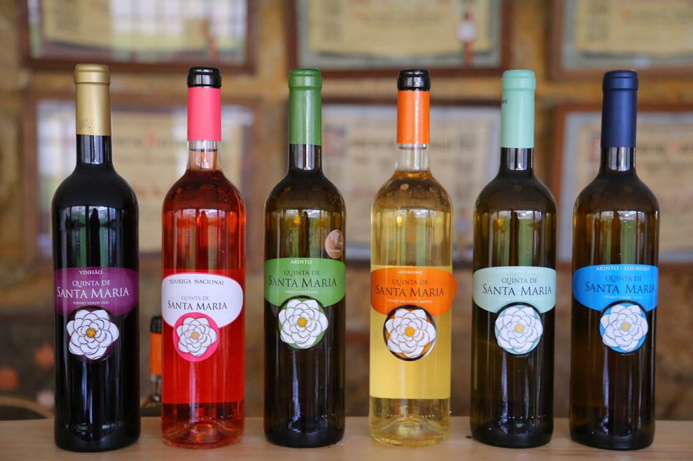

## Introduction

Data mining techniques aim at extracting knowledge from raw data. Several DM algorithms have been developed, each one with its own advantages and disadvantages \citep{witten_data_2011}. Those approaches have been applied to a large variety of problems, either for classification or regression. An interesting problem that has captured the attention of several researches is the prediction of wine quality \citep{CorCer09}. Wine industry is investing in new technologies for wine making and selling processes. A key issue in this context is wine certification which prevents the illegal adulteration and assures the wine quality. Wine certification is often assessed by physicochemical and sensory tests. The development of an accurate, computationally efficient and understandable prediction model can be of great utility for the wine industry. On the one hand, a good wine quality prediction can be very useful in the certification phase, since currently the sensory analysis is performed by human tasters, being clearly a subjective approach. An automatic predictive system can be integrated into a decision support system, helping the speed and quality of the oenologist performance. If it is concluded that several input variables are highly relevant to predict the wine quality, since in the production process some variables can be controlled, this information can be used to improve the wine quality. In this research wine taste preferences are modeled by algorithms. 

## Background

Portugal is a top ten wine exporting country with
3.17% of the market share in 2005 \citep{faostat}. Exports of its Vinho Verde wine (from
the northwest region) have increased by yearly. To support
its growth, the wine industry is investing in new technologies for both wine
making and selling processes. Wine certification and quality assessment are
key elements within this context. Certification prevents the illegal adulteration
of wines (to safeguard human health) and assures quality for the wine market.
Quality evaluation is often part of the certification process and can be used
to improve wine making (by identifying the most influential factors) and to
stratify wines such as premium brands (useful for setting prices).
Wine certification is generally assessed by physicochemical and sensory tests
\citep{teranishi_flavor_1999}. Physicochemical laboratory tests routinely used to characterize wine include
determination of density, alcohol or pH values, while sensory tests rely
mainly on human experts. It should be stressed that taste is the least understood
of the human senses, thus wine classification is a difficult task.
Moreover, the relationships between the physicochemical and sensory analysis
are complex and still not fully understood \citep{legin_evaluation_2003}.

## Objective

The objective of this project is is to provide a reliable and feasible recommendation algorithm to predict wine quality based on physicochemical tests.  The target value is a numeric value of wine 'quality', hence the task could be solved by several regression methods, like Random Forest, Support Vector Machines and Neural Networks. In addition, it was decided to apply Clustering Analysis to investigate if we could predict the quality better or if we could get any new knowledge from the dataset.

\newpage

# Data understanding

The two datasets presented in \citep{WineDataset} are related to red and white variants of the Portuguese "Vinho Verde" wine. For more details, consult \citep{CorCer09}. Due to privacy and logistic issues, only physicochemical (inputs) and sensory (the output) variables are available (e.g. there is no data about grape types, wine brand, wine selling price, etc.). The classes are ordered and not balanced (e.g. there are much more normal wines than excellent or poor ones). 

```
The dataset contains 6497 observations:

Input variables (based on physicochemical tests): 
  1 - fixed acidity        (FA)
  2 - volatile acidity     (VA)
  3 - citric acid          (CA)
  4 - residual sugar       (RS)
  5 - chlorides            (CH)
  6 - free sulfur dioxide  (FSD)
  7 - total sulfur dioxide (TSD)
  8 - density              (DEN)
  9 - pH                   (pH)
  10 - sulphates           (SUL)
  11 - alcohol             (ALC) 

Output variable (based on sensory data): 
  12 - quality, based on sensory data (score between 0 and 10) - (QLT)
  13 - wine type (0 - red wine, 1 - white wine)
```

Let's try to make sense of those attributes. There are many so called "impact compounds" in wine defining its taste and smell. Some of them are obvious, like ALC, DEN and RS. Some of them are really bizarre \citep{noauthor_weird_2017}. The chemical components mentioned in the list have the following influence on the wine taste.

First is "Type" - red wine is different from white wine \citep{busch_learn_2011}. They look different and they certainly taste different as well. The culprit in both cases: the skins, and a little something they bring to the party called tannins. Tannin provides the backbone of red wine, which is why you might describe a red wine as “firm” or “leathery” or just plain “bitter.” White wine has tannin, but not enough to make it the star of the show. Instead, white wines are backboned by acidity. That’s why you might say a wine is “crisp” or “tart.” 

Then there is volatile acidity (VA) that intensifies the taste of the other acids and tannins \citep{corison_must_1979}. As the name suggests it is referencing volatility in wine, which causes it to go bad. Acetic acid builds up in wine when there’s too much exposure to oxygen during winemaking and is usually caused by acetobacter (the vinegar-making bacteria!). VA is considered a fault at higher levels (1.4 g/L in red and 1.2 g/L in white) and can smell sharp like nail polish remover. But at lower levels, it can add fruity-smelling raspberry, passion fruit, or cherry-like flavors

Sulphur dioxide (SO2) is used to inhibit or kill unwanted yeasts and bacteria, and to protect wine from oxidation. Important concentrations of SO2 can affect the smell of the wine. It is also most-often noted on the finish, with some wines displaying a strong flavor of Sulphur after you've tasted (or swallowed) on the back of the mouth. Red wine contains less Sulphur Dioxide than white and rose as the above regulations show. Generally speaking, the drier the wine, the lesser the amount of SO2 it contains. \citep{noauthor_sulfites_nodate}.

In wine tasting, the general term “acidity” defined by pH, FA and CA, refers to the fresh, tart and sour attributes of the wine which are evaluated in relation to how well the acidity balances out the sweetness and bitter components of the wine such as tannins.

Sulfates (SUL) aren't involved in wine production, but some beer makers use calcium sulfate—also known as brewers' gypsum—to correct mineral deficiencies in water during the brewing process. Sulfites are naturally occurring compounds found in all wines; they act as a preservative by inhibiting microbial growth. 

The amount of CH in wine is influenced by both the terroir and type of grape \citep{coli_chloride_2015}, and the importance of quantification lies in the fact that wine flavor is strongly impacted by this particular ion, which, in high concentration, gives the wine an undesirable salty taste.

\newpage

## Data Preparation
To perform the analysis, certain R libraries were used. The code below was used to load and initialize the librarie, then loads the data.  To pretty-print the tables in this report we used xtable \citep{R-xtable} library.

```{r message=FALSE, warning=FALSE}
set.seed(42)
library(ggplot2)
library(reshape2)
library(plyr)
library(readr)
library(fpc)
library(data.table)
library(ggplot2)
```

```{r message=FALSE, warning=FALSE}
wines_red_data <- 
  read.csv(
    "http://archive.ics.uci.edu/ml/machine-learning-databases/wine-quality/winequality-red.csv",
    sep=";", 
    header = TRUE, 
    col.names = c("FA","VA","CA","RS","CH","FSD","TSD","DEN","pH","SUL","ALC","QLT"))

wines_red_data$TYPE <- 0
```

```{r message=FALSE, warning=FALSE}
wines_white_data <- 
  read.csv(
    "http://archive.ics.uci.edu/ml/machine-learning-databases/wine-quality/winequality-white.csv",
    sep=";", 
    header = TRUE, 
    col.names = c("FA","VA","CA","RS","CH","FSD","TSD","DEN","pH","SUL","ALC","QLT"))

wines_white_data$TYPE <- 1
```

```{r}
wines_data <- rbind(wines_red_data, wines_white_data)
```

## Preview of the data

Quick view of the data attributes statistics presented in the Table \ref{table:sum_rw}. For each attribute in the dataset this table shows min, max, mean and normal distribution 1st and 3rd quartiles values. The first rows of the dataset are presented in Table \ref{table:dhead10}. The dataset has no missing values.

```{r echo=FALSE, message=FALSE, warning=FALSE, paged.print=FALSE, results='asis'}
library(xtable)
options(xtable.floating = TRUE)
options(xtable.timestamp = "")
options(xtable.comment = FALSE)
print (xtable(head(wines_red_data, n = 20), 
  caption = "\\tt Red Wines Quality Dataset - first rows", label = "table:dhead10"), scalebox=.9)
```

```{r echo=FALSE, message=FALSE, warning=FALSE, paged.print=FALSE, results='asis'}
print(xtable(summary(wines_data[,1:6])), include.rownames = FALSE, scalebox=.9)
print(xtable(summary(wines_data[,7:12]), 
  caption = "\\tt Wine Dataset Attributes Summary", label = "table:sum_rw"),include.rownames = FALSE, scalebox=.9)
```

\newpage 

## Distribution of values in the dataset
As it was mentioned before, the target value QLT of the wine quality is not equally distributed. The Figure \ref{fig:hist_1} demonstrates the distribution. As we can see, dataset covers mostly medium-quality wines with QLT between  5 and 7 well, low and high  quality wines represented poorly. Code below calculates this distribution.

```{r}
print(prop.table(table(wines_data$QLT)), digits = 4)
```

```{r hist_1, fig.pos = 'h', fig.height=2.5, fig.width=5.5, fig.align="center", fig.cap="Distribution of QLT in the wine dataset"}
ggplot(data = wines_data, mapping = aes(x = QLT)) + geom_bar()

```

The Figure \ref{fig:dist1} demonstrates correlation of the most important "taste" attribute to the quality of the wines. As we can see from those charts, there is no direct correlation of any single attribute. Either they work in combination, or the dataset is missing important characteristics that affect human perception of the wine taste. 

```{r dist1, echo=FALSE, fig.align="center", fig.cap="Correlation of QLT to the \"taste\" attributes", fig.height=9, fig.width=5.5, paged.print=FALSE}
library(ggplot2)
df2 = data.frame(as.factor(wines_data$QLT), wines_data$VA)
colnames(df2) <- c("QLT","VA")
p1 <- ggplot(df2, aes(x = QLT, y = VA)) +
        geom_boxplot(outlier.colour = "red") +
        geom_jitter(width = 0.25, pch=20, col=rgb(0.1, 0.2, 0.8, 0.1))

df2 = data.frame(as.factor(wines_data$QLT), wines_data$ALC)
colnames(df2) <- c("QLT","ALC")
p2 <- ggplot(df2, aes(x = QLT, y = ALC)) +
        geom_boxplot(outlier.colour = "red") +
        geom_jitter(width = 0.25, pch=20, col=rgb(0.1, 0.2, 0.8, 0.1))

df2 = data.frame(as.factor(wines_data$QLT), wines_data$FSD)
colnames(df2) <- c("QLT","FSD")
p3 <- ggplot(df2, aes(x = QLT, y = FSD)) +
        geom_boxplot(outlier.colour = "red") +
        geom_jitter(width = 0.25, pch=20, col=rgb(0.1, 0.2, 0.8, 0.1))

df2 = data.frame(as.factor(wines_data$QLT), wines_data$pH)
colnames(df2) <- c("QLT","pH")
p4 <- ggplot(df2, aes(x = QLT, y = pH)) +
        geom_boxplot(outlier.colour = "red") +
        geom_jitter(width = 0.25, pch=20, col=rgb(0.1, 0.2, 0.8, 0.1))


df2 = data.frame(as.factor(wines_data$QLT), wines_data$SUL)
colnames(df2) <- c("QLT","SUL")
p5 <- ggplot(df2, aes(x = QLT, y = SUL)) +
        geom_boxplot(outlier.colour = "red") +
        geom_jitter(width = 0.25, pch=20, col=rgb(0.1, 0.2, 0.8, 0.1))
library(gridExtra)
grid.arrange(p1, p2, p3, p4, p5, ncol = 1)
```

\newpage

# Modelling of the Wine Quality

## Splitting the wine into train and test sets

The wine dataset has been split in such a way that train and test sets would have the same distribution of the QLT attribute. We used 70:30 split ratio. 

```{r message=FALSE, warning=FALSE}
library(caret)
cluster1 <- wines_data[,1:12]
train1.rows<- createDataPartition(y= cluster1$QLT, p=0.7, list = FALSE)
train1.data<- cluster1[train1.rows,]
test1.data<- cluster1[-train1.rows,]
```

## Random Forests Prediction

First we use advanced but computationally demanding Random Forest method \citep{noauthor_random_2018}. Decision trees are a popular method for various machine learning tasks. Tree learning "come[s] closest to meeting the requirements for serving as an off-the-shelf procedure for data mining because it is invariant under scaling and various other transformations of feature values, is robust to inclusion of irrelevant features, and produces inspectable models. However, they are seldom accurate". In particular, trees that are grown very deep tend to learn highly irregular patterns: they overfit their training sets, i.e. have low bias, but very high variance. Random forests are a way of averaging multiple deep decision trees, trained on different parts of the same training set, with the goal of reducing the variance. This comes at the expense of a small increase in the bias and some loss of interpretability, but generally greatly boosts the performance in the final model.

```{r message=FALSE, warning=FALSE}
library(randomForest)
fitRF1 <- randomForest(
  QLT ~ ., method="anova",
  data=train1.data, importance=TRUE, ntree=500)
```

Random forests can be used to rank the importance of variables in a regression or classification problem in natural way. To measure the importance of the j-th feature after training, the values of the j-th feature are permuted among the training data and the out-of-bag error is again computed on this perturbed data set. The score is normalized by the standard deviation of these differences.

Features which produce large values for this score are ranked as more important than features which produce small values. The Figure \ref{fig:forimp} presents this analysis. As we can see, the most important chemicals influencing the wine taste are ALC, VA. Next come SUL and FSD.

```{r forimp, fig.width=5.5, fig.height=5, fig.align="center", message=FALSE, warning=FALSE, paged.print=FALSE, fig.cap="Importance of the dataset attributes for the prediction of the QLT attribute"}
varImpPlot(fitRF1, main="")
```

The accuracy of the RF prediction is calculated below. Table \ref{table:confMat2} presents re results of the RF analysis in the form of a confusion matrix. The visual presentation of the calculations is presented in Figure \ref{fig:plot_rf_rw}.

```{r}
PredictionRF1 <- predict(fitRF1, test1.data)
cor(PredictionRF1,test1.data$QLT)
```

```{r echo=FALSE, message=FALSE, warning=FALSE, paged.print=FALSE, results='asis'}
xtable(table(round(PredictionRF1),test1.data$QLT), caption = "\\tt Random Forest Pledictor Confusion Matrix", label = "table:confMat2")
```


```{r plot_rf_rw, fig.width=5.5, fig.height=4, fig.align="center", message=FALSE, warning=FALSE, paged.print=FALSE, fig.cap="Random Forest Prediction"}
library(ggplot2)
df2 = data.frame(as.factor(test1.data$QLT), PredictionRF1)
colnames(df2) <- c("Test","Prediction")
ggplot(df2, aes(x = Test, y = Prediction)) +
        geom_boxplot(outlier.colour = "red") +
        geom_jitter(width = 0.25, pch=20, col=rgb(0.1, 0.2, 0.8, 0.3))
```

## Support Vector Regression

The Support Vector Regression (SVR) uses the same principles as the SVM for classification, with only a few minor differences. First of all, because output is a real number it becomes very difficult to predict the information at hand, which has infinite possibilities. In the case of regression, a margin of tolerance (epsilon) is set in approximation to the SVM which would have already requested from the problem. But besides this fact, there is also a more complicated reason, the algorithm is more complicated therefore to be taken in consideration. However, the main idea is always the same: to minimize error, individualizing the hyperplane which maximizes the margin, keeping in mind that part of the error is tolerated.

Code below runs the SVR prediction and evaluates its accuracy. As we can see from the Table \ref{table:confMat3} and Figure \ref{fig:plot_rf1_rw}, the accuracy is about 63%, almost 10% less than accuracy of the RF prediction, but the prediction of QLT for the high quality wines increase almost 10%.

```{r echo=TRUE, message=FALSE, warning=FALSE}
library("e1071")
svm_model <- svm(QLT ~ ., data=train1.data)
predSVM <- predict(svm_model, test1.data)
cor(predSVM,test1.data$QLT)
```

```{r echo=FALSE, message=FALSE, warning=FALSE, paged.print=FALSE, results='asis'}
xtable(table(round(predSVM),test1.data$QLT), caption = "\\tt SVR Predictor Confusion Matrix", label = "table:confMat3")
```

```{r plot_rf1_rw, echo=FALSE, fig.align="center", fig.cap="SVR Prediction", fig.height=4, fig.width=5.5, message=FALSE, warning=FALSE, paged.print=FALSE}
library(ggplot2)
df2 = data.frame(as.factor(test1.data$QLT), predSVM)
colnames(df2) <- c("Test","Prediction")
ggplot(df2, aes(x = Test, y = Prediction)) +
        geom_boxplot(outlier.colour = "red") +
        geom_jitter(width = 0.25, pch=20, col=rgb(0.1, 0.2, 0.8, 0.3))
```

\newpage

## Neural Networks Modeling

Neural Networks (NN) computing systems vaguely inspired by the biological neural networks that constitute animal brains. Such systems "learn" to perform tasks by considering examples, generally without being programmed with any task-specific rules. Neural networks have always been one of the fascinating machine learning models, not only because of the fancy backpropagation algorithm but also because of their complexity (think of deep learning with many hidden layers) and structure inspired by the brain.

### Preparing scaled data

Using NN requires all the data to be normalized. The code below performs uniform scaling of the dataset and splitting it into train and test sets.

```{r}
set.seed(4231)
data <- wines_data[,1:12]
index <- sample(1:nrow(data),round(0.75*nrow(data)))
maxs <- apply(data, 2, max) 
mins <- apply(data, 2, min)
scaled <- as.data.frame(scale(data, center = mins, scale = maxs - mins))
train_ <- scaled[index,]
test_ <- scaled[-index,]
```

### NN model
The R "neuralnet"" package is used for this task in the report \citep{noauthor_fitting_nodate}. Code below creates the NN model and trains it using the train set. Figure \ref{fig:plot_nn} demonstrates the NN model with the weights on each connection used for calculations.

```
library(neuralnet)
n <- names(train_)
f <- as.formula(paste("QLT ~", paste(n[!n %in% "QLT"], collapse = " + ")))
f
nn <- neuralnet(f,data=train_,hidden=c(6,3),linear.output=F)
```

```{r echo=FALSE, message=FALSE, warning=FALSE}
library(neuralnet)
n <- names(train_)
f <- as.formula(paste("QLT ~", paste(n[!n %in% "QLT"], collapse = " + ")))
f
#nn <- neuralnet(f,data=train_,hidden=c(6,3),linear.output=F)
```

```{r plot_nn, echo=FALSE, fig.cap="Graphical representation of the NN model with the weights on each connection", message=FALSE, warning=FALSE, out.width = "1.1\\textwidth"}
#plot(nn)
knitr::include_graphics("images/nn_lg.png")
```


### Predicting wine quality using neural networks

NN outputs a normalized prediction, so we need to scale it back in order to make a meaningful comparison (or just a simple prediction). The code below performs that conversion. We calculated prediction of the NN model for the test set and discovered, that NN has overall accuracy about 60% which is lower than RF and SVR, but NN has better precision for best and worst wines than other method we used. Figure \ref{fig:plot_rf2_rw1} and Table \ref{table:confMat4} present the results of the calculations.

```
pr.nn <- compute(nn,test_[,1:11])
pr.nn_ <- pr.nn$net.result*(max(data$QLT)-min(data$QLT))+min(data$QLT)
test.r <- (test_$QLT)*(max(data$QLT)-min(data$QLT))+min(data$QLT)
cor(test.r,pr.nn_)
```

```{r eval=FALSE, message=FALSE, warning=FALSE, include=FALSE}
pr.nn <- compute(nn,test_[,1:11])
pr.nn_ <- pr.nn$net.result*(max(data$QLT)-min(data$QLT))+min(data$QLT)
test.r <- (test_$QLT)*(max(data$QLT)-min(data$QLT))+min(data$QLT)
cor(test.r,pr.nn_)
```

```{r eval=FALSE, message=FALSE, warning=FALSE, include=FALSE, paged.print=FALSE, results='asis'}
xtable(table(round(pr.nn_),as.factor(test.r)), caption = "\\tt NN Pledictor Confusion Matrix", label = "table:confMat4")
```

\begin{table}[ht]
\centering
\begin{tabular}{rrrrrrrr}
  \hline
 & 3 & 4 & 5 & 6 & 7 & 8 & 9 \\ 
  \hline
4 &   0 &   2 &   5 &   0 &   0 &   0 &   0 \\ 
  5 &   8 &  28 & 336 & 189 &  10 &   0 &   0 \\ 
  6 &   1 &  13 & 179 & 456 & 137 &  19 &   0 \\ 
  7 &   0 &   0 &   6 &  97 & 115 &  21 &   2 \\ 
   \hline
\end{tabular}
\caption{\tt NN Pledictor Confusion Matrix} 
\label{table:confMat4}
\end{table}

```

## [1] 0.6043741164
```

```{r plot_rf2_rw1, echo=FALSE, fig.align="center", fig.cap="Neural Network Prediction Scatter Plot", fig.height=4, fig.width=5.5, out.width = "1\\textwidth"}
knitr::include_graphics("images/nn_scatter.png")
```

```{r plot_rf2_rw, eval=FALSE, fig.align="center", fig.cap="Neural Network Predictor Scatter Plot", fig.height=5, fig.width=8, message=FALSE, warning=FALSE, include=FALSE, paged.print=FALSE}
library(ggplot2)
df2 = data.frame(as.factor(test.r), pr.nn_)
colnames(df2) <- c("Test","Prediction")
ggplot(df2, aes(x = Test, y = Prediction)) +
        geom_boxplot(outlier.colour = "red") +
        geom_jitter(width = 0.25, pch=20, col=rgb(0.1, 0.2, 0.8, 0.3))
```

\newpage

# Cluster Analysis

The modeling of the wine quality does not answer many important questions. We will attempt to answer two of them in this report:

- Was the dataset properly labeled by human experts? Is there a bios here?
- Can we guess wine type by its physicochemical content (Fig \ref{fig:wines})?

To answer those questions we will apply Clustering Analysis. Cluster is a collection of data objects similar to one another within the same cluster, dissimilar to the objects in other clusters. Cluster analysis is grouping a set of data objects into clusters. Clustering is unsupervised classification, no predefined classes assumed.

```{r wines, echo=FALSE, fig.align="center", out.width=".7\\textwidth", fig.cap="Vihno Verde Wine Types"}

```

\newpage

## Preparation for cluster analysis

### Wines dataset normalizing

Normalizing wine dataset in preparation for clustering is done with help of the code below. The statistical characteristics of the attributes after the normalizing presented in Table \ref{table:sum_rw}.
```{r}
wines_data.std <- scale(wines_data[1:11])
```

```{r echo=FALSE, message=FALSE, warning=FALSE, paged.print=FALSE, results='asis'}
print(xtable(summary(head(wines_data.std[,1:6]))), include.rownames = FALSE, scalebox=.9)
print(xtable(summary(head(wines_data.std[,7:11])), 
  caption = "\\tt Wine Dataset Normalized Attributes Summary", label = "table:sum_rw"),include.rownames = FALSE, scalebox=.9)
```

### Determine optimal number of clusters
First we need to determine number of clusters. 
Looking at the percentage of variance explained as a function of the number of clusters, we should choose a number of clusters in order to ensure that too much modeling of the data is not given. More precisely, if one plots the percentage of variance explained by the clusters against the number of clusters, the first clusters will add much more information (explains a lot of variance); but at some point, the marginal gain will drop, giving an angle in the graph. The number of clusters is chosen at this point. 

This method is called the 'elbow criterion'. The code below calculated and prints the "Elbow Criterion Diagram":

```{r elbow,  fig.height=4, fig.width=5.5, message=FALSE, warning=FALSE, fig.cap="Elbow Criterion Diagram"}
wssplot <- function(data, nc=15, seed=1234){
  wss <- (nrow(data)-1)*sum(apply(data,2,var))
  for (i in 2:nc){
    set.seed(seed)
    wss[i] <- sum(kmeans(data, centers=i)$withinss)}
  plot(1:nc, wss, type="b", xlab="Number of Clusters",
       ylab="Within groups sum of squares")}

wssplot(wines_data.std, nc=8) 
```

The diagram presented in Figure \ref{fig:elbow} demonstrates the calculated 'elbow' curve. From this diagram we decided to use three (3) clusters in our analysis.


## Clustering using K-means method

k-means clustering \citep{k_means_2018} is a method of vector quantization, which is popular for cluster analysis in data mining. k-means clustering aims to partition n observations into k clusters in which each observation belongs to the cluster with the nearest mean, serving as a prototype of the cluster. This results in a partitioning of the data space into Voronoi cells \citep{noauthor_nouvelles_1908}.

The problem is computationally difficult (NP-hard), k-means clustering tends to find clusters of comparable spatial extent, while the expectation-maximization mechanism allows clusters to have different shapes. 

The algorithm has a loose relationship to the k-nearest neighbor classifier. One can apply the 1-nearest neighbor classifier on the cluster centers obtained by k-means to classify new data into the existing clusters. This is known as nearest centroid classifier or Rocchio algorithm.

Resulting cluster centers are presented in Table \ref{table:kcent1}.

```{r}
set.seed(420)
clusters_num = 3
k.means.fit <- kmeans(wines_data.std, clusters_num,iter.max = 1000)
```


```{r echo=FALSE, message=FALSE, warning=FALSE, paged.print=FALSE, results='asis'}
#library(xtable)
#options(xtable.floating = TRUE)
#options(xtable.timestamp = "")
#options(xtable.comment = FALSE)

dh.rescale <- xtable(k.means.fit$centers,
  caption = "\\tt K-means Resulting Cluster Centers", label = "table:kcent1")

print(dh.rescale, scalebox=1)
```

```{r fig.height=9, fig.width=6, fig.cap="2D representation of the Cluster solution"}
library(cluster)
clusplot(wines_data.std, k.means.fit$cluster, main='',
         color=TRUE, shade=FALSE,
         labels=clusters_num, lines=0)
```

## Explain Clusters by Wine Quality

Let's try to explain clusters by the wine quality. Code below builds a matrix when columns are cluster numbers and rows are wine types. As we can see, quality does not explain clusters, it's evenly distributed among them.
QLT does not explain clusters, see Table \ref{table:clust_qlt}.

```{r echo=FALSE, message=FALSE, warning=FALSE, results='asis'}
xtable(table(wines_data[,12],k.means.fit$cluster),
  caption = "\\tt Explaining Clusters by QLT", label = "table:clust_qlt")
```

\newpage

## Explain Clusters by Wine Type

Let's try to explain clusters by the wine type. Code below builds a matrix when columns are cluster numbers and rows are wine types. As we can see, cluster 3 contains red wines, cluster 1 and 2 contain white wine, see Table \ref{table:clust_type1}.

```{r}
centers <- table(wines_data[,13],k.means.fit$cluster)
```

```{r echo=FALSE, message=FALSE, warning=FALSE, results='asis'}
rownames(centers) <- c("Red Wine", "White Wine")
xtable(centers,
  caption = "\\tt Explaining 3 Clusters by Wine Type", label = "table:clust_type1")
```

Let's try to figure out how white wine clusters 1 and 2 differ from each other. Code below calculates a difference vector of cluster 1 and 2 and sorts the attributes in the order of the most influence. The results presented in Table \ref{table:dif1}.

```{r}
Difference <- k.means.fit$centers[1,] - k.means.fit$centers[2,]
Difference <- Difference[order(abs(Difference), decreasing = T)]
```

```{r echo=FALSE, message=FALSE, warning=FALSE, paged.print=FALSE, results='asis'}
dh.rescale <- xtable(data.frame(Difference),
  caption = "\\tt Difference between Clusters 1 and 1", label = "table:dif1")
print(dh.rescale, scalebox=1)
```

The table shows that clusters 1 and 2 are mostly  differ in sweetness (RS), viscosity (DEN) and alcohol content (ALC). This makes: 

 - Cluster 1 is sweet white wines group
 - Cluster 2 contains dry white wines

\newpage 

## More Wine Groups

Next we decided to try the second "elbow" on Figure \ref{fig:elbow} at 6 clusters. The resulting cluster centers presented in Table \ref{table:kcent2}.

```{r  fig.height=10, fig.width=10}
set.seed(420)
clusters_num = 6
k.means.fit <- kmeans(wines_data.std, clusters_num,iter.max = 1000)
```

```{r echo=FALSE, message=FALSE, warning=FALSE, paged.print=FALSE, results='asis'}
dh.rescale <- xtable(k.means.fit$centers,
  caption = "\\tt K-means Resulting Cluster Centers - 6 Clusters", label = "table:kcent2")

print(dh.rescale, scalebox=1)
```

```{r echo=FALSE, message=FALSE, warning=FALSE, results='asis'}
centers <- table(wines_data[,13],k.means.fit$cluster)
rownames(centers) <- c("Red Wine", "White Wine")
xtable(centers,
  caption = "\\tt Explaining 6 Clusters by Wine Type", label = "table:clust_type1")
```

Let's try to figure out how white wine clusters 3 and 4 differ from each other. Code below calculates a difference vector of cluster 3 and 4 and the sort the attributes in the order of the most influence:

```{r}
Difference <- k.means.fit$centers[3,] - k.means.fit$centers[4,]
Difference <- Difference[order(abs(Difference), decreasing = T)]
```

Let's find what are the most significant factors that separate group 3 from group 4. Code below calculates the different results presented in Table \ref{table:dif2}.

```{r echo=FALSE, message=FALSE, warning=FALSE, paged.print=FALSE, results='asis'}
dh.rescale <- xtable(data.frame(Difference),
  caption = "\\tt Difference between Clusters 3 and 4", label = "table:dif2")
print(dh.rescale, scalebox=1)
```

What's the difference between red wines 3 and 4? Looking at the most important attributes difference and relying on the explanation how thosw chemicals affect the wine taste and taking into account information we discovered about Vihno Verde wines we can conclude that:

- Cluster 3 - contains young fruity sour rose wines
- Cluster 4 - contains old red wines with a bit of bitterness

Unfortunately, lack of more specific information about connection of physicochemical components to the wine taste, this is the most that we could conclude from the cluster analysis. The dataset is missing some important attributes that would help us to cluster wines and predict the quality more reliably.

\newpage

# Conclusion
Through exploring the Wine Quality dataset we developed an algorithm to predict the wine quality using its chemical characteristics and extracted some interesting information about the wines presented. 

First we applied the Random Forest Regression method and achieved accuracy of predicting wine quality of 72%. The method has shown that the most important attributes that influence the quality estimation of wines by human experts are alcohol (ALC), volatile acidity (VA) and free sulfur dioxide (FSD). The RF method showed low precision in the area of poor and high quality wines. 

Next we applied a Support Vector Regression method (SVR) and achieved accuracy of 62, lower than RF, but the precision in the area of poor and high quality wines increased at least 20%.

Next we applied a Neural Networks (NN) regression cofigured with 11:6:3:1 layers and achieved overall accuracy of 60%, lower than both RF and SVR. Interestingly, the precision of NN in the area of poor and high quality wines was almost 10% higher than SVR, making NN the best method in quality prediction of the most interesting and least presented sector of wines in the dataset.

Finally, we applied Cluster Analysis (CA) to investigate if we could predict the quality better or if we could get any new knowledge from the dataset. We discovered that there is no correlation between wine quality and biochemical data from the CA point of view. On the other hand, there is a strong correlation between clusters and wine types. Even though the information about influence of 11 chemical characteristics on the taste of wine is very limited, we discovered clusters that contain such types of wine as white sweet, white dry, rose and old dry red. We can add that more subtypes of wine were discovered, but it is difficult to give them specific names using only the dataset at hand.

The project was a success. Next steps would be collecting more information about relation of the base chemical component on the wine taste and finding datasets with additional wine attributes, related more to the human interpretation of wines, and connects those datasets with the one used in the project.

\newpage

\bibliography{RJreferences}

\newpage

# Note from the Authors
This file was generated using [_The R Journal_ style article template](https://github.com/rstudio/rticles), additional information on how to prepare articles for submission is here - [Instructions for Authors](https://journal.r-project.org/share/author-guide.pdf). The article itself is an executable R Markdown file that could be [downloaded from Github](https://github.com/ivbsoftware/big-data-final-2/blob/master/docs/R_Journal/big-data-final-2/) with all the necessary artifacts \citep{ivbsoftware_big-data-final}.


